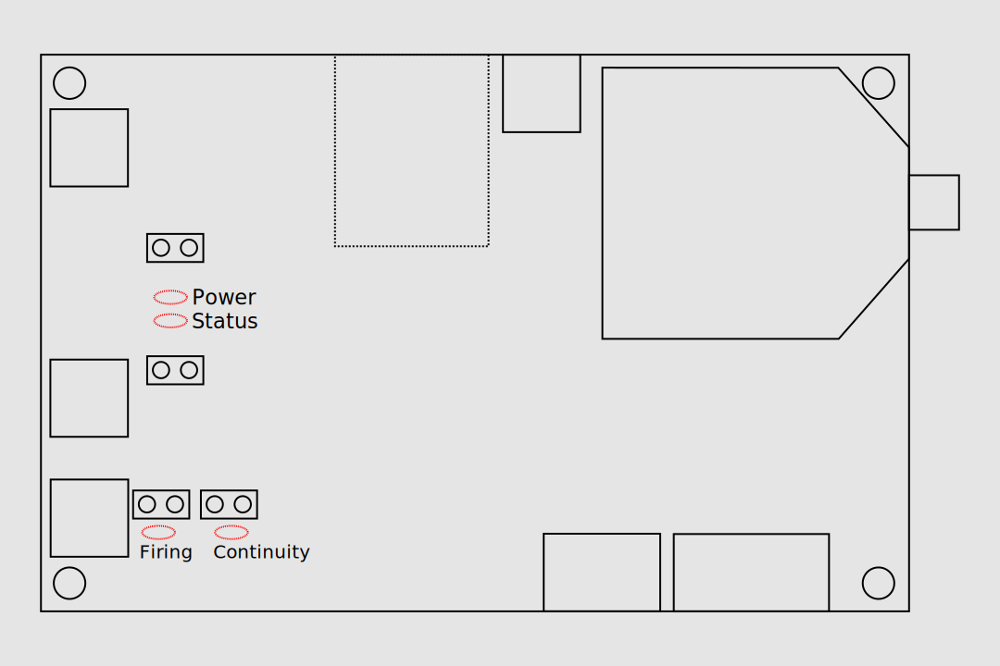

# Rocket Motor Test System
RMTS is a complete set of test stand electronics in a single device for amateur motor builders. It was designed to be a simple and safe way to ignite solid rocket motors and collect data from their firing to enable hobbyists to make informed decisions as they iterate on their propellant formulas and motor designs. It is similar in complexity to a standard rocketry altimeter and doesn't require any special skills to use. It is a standalone unit meaning you don't need to leave a computer near the motor. As it is specialized for rocketry, it displays thrust and pressure curves immediately after the firing without needing to pass the data through a spreadsheet. The built in wireless ignition channel reduces the number of devices you need to set up to one and allows you to measure the motor's startup transient as logging begins when the igniter fires.
## Components
The system consists of a transmitter, receiver, and an application that is run on the user's computer. The transmitter is the larger of the two circuit boards included in the system and has terminal blocks around the edge for connecting transducers and the igniter. The receiver is the smaller board and has two connectors, one USB port for connecting to the user's computer and an RP-SMA jack for the antenna. The software can be downloaded from [here](https://github.com/reilleya/RMTS-Software/releases).
## Using RMTS
Before using RMTS for the first time you will need to calibrate it. More information about what that entails it found [here](https://github.com/reilleya/RMTS-Manual#calibration).
To assemble and use the system for a series of static fires, follow [this](https://github.com/reilleya/RMTS-Manual#firing-procedure) guide.

## Connection Diagram

## LED Explanations

The main RMTS board has four LEDs to indicate system status. The first is the `Power` indicator, which turns on as soon as the board is connected to a 5V supply. Next to it is the `Status` light, which has a number of blink patterns to show which state the board is currently in. Next is the `Continuity` LED, which indicates that the system has detected continuity throught the igniter circuit, including both the pyro battery and the igniter itself. Finally, the `Firing` indicator shows if the igniter port has a voltage across it. Never connect the igniter while this light is on. If it is on unexpectedly, your RMTS has been damaged. Next to each LED is a pair of through-holes that an external LED can be connected to.

#### Status LED Blink Patterns
| Pattern                  | Explanation                                                                                                                                 |
|--------------------------|---------------------------------------------------------------------------------------------------------------------------------------------|
| Two Fast Blinks          | System is in `setup` state. It is for a firing or calibration.                                                                              |
| Constant, Rapid Blinking | System is in `error` state. Connect to it with the radio for more details.                                                                  |
| Off                      | System is in `fire` state. Stop it in the application to view results.                                                                      |
| Slow Blinking            | System is in `results` state. The results can be viewed in the application. It can be safely powered off as the results are on the SD card. |
## Setup
### Hardware
Follow the connection diagram [here](https://github.com/reilleya/RMTS-Manual#connection-diagram). All system functions require an SD card to be installed. Note that the pyro battery and transducers require a specific polarity! The system may be damaged or produce incorrect results if they are not connected properly. For this reason and to protect the transmitter from damage during tests, it is recommended to mount it in a project enclosure and to attach connectors to the screw terminals so transducers can be plugged in easily. The transmitter is powered by the USB port and will work with any USB backup battery. The included antennas can be swapped for other RP-SMA 2.4 ghz antennas if needed. 
### Software
Install the RMTS application on a computer that is convenient to bring to your test site and has at least one USB A port. The latest version can be downloaded [here](https://github.com/reilleya/RMTS-Software/releases). An installer is available for Windows and an executable for Mac OS, but Linux users will have to follow instructions in the readme for that repository. Once the application is installed, configure the desired units on the `Preferences` menu and then proceed to calibration.
## Calibration
RMTS is different from other rocketry electronics you may be familiar with as its sensors are external to the board and can be swapped by the user. This is beneficial as it allows you to use transducers well suited for each motor you fire and may be able to use ones you already have. The downside is that the characteristics of sensors you choose to use cannot be built into the software and have to be deternined by you. The RMTS application includes a workflow to make this process simple, and this guide explains how to use it and what is happening internally.
### What is a transducer?
A transducer is a device that converts a signal from one kind of energy (mechanical, thermal, electrical, etc) to another. The transducers that we are interested in for testing motors are sensors, which convert a property of the physical world into a signal that we can read. The specific sensors that RMTS is designed to read from are [load cells](https://en.wikipedia.org/wiki/Load_cell) and [pressure transducers](https://en.wikipedia.org/wiki/Pressure_sensor), which convert force and pressure, respectively, into electrical signals. For more details on how they do this, consult the articles linked above.
### What is transducer calibration?
The transducers that RMTS is designed to work with output a voltage that corresponds to the force or pressure that is applied to the transducer. There is no single standard that describes what voltage a transducer should output for a given input. Even transducers from a single manufacturer of the same model have slightly different outputs for the same physical input. Fortunately, most transducers produce a simple linear response to their input, as shown in the figure. By applying a few different inputs to the transducer and measuring the outputs, we can find the relation and use it to convert any future voltage readings RMTS makes to the real quantities they correspond to.
### RMTS Calibration Workflow
The RMTS application provides a workflow that collects the data required to perform a transducer calibration. It can be accessed by pressing the `Calibrate Transducers` button on the main menu. On the next screen, enter a name for the transducer calibration and select the type (Load Cell or Pressure Transducer). Next, connect the transducer you are looking to calibrate to your transmitter according to the connection diagram. Power on the transmitter and make sure it is nominal (SD inserted) before connecting the receiver to your computer, refreshing the list of ports, and pressing connect. If everything is set up properly the `Data Age` field will stay close to 0 and no error will be displayed. Press the `Next` button, which will be enabled at this point.

You are now on the main calibration screen. This screen displays the last raw value read from the transducer selected on the previous screen in the top left of the screen in a unitless field. Next to it is a button that allows you to "capture" the current value that the transducer is outputting and add it to the table below. To calibrate the transducer, apply a series of known inputs and capture each, then enter the corresponding measurement in real units. For example, if you have a pressure transducer attached to a regulated supply, you could set the regulator for 200 PSI, click `Capture`, and then type `200` next to the raw value in the table. When a point has both a raw and a real value associated with it, it will be plotted in the graph. When at least three points have been entered, the software will calculate a line of best fit for them and plot it over them. It will also show the current real value obtained by converting the last transducer reading it has received through the calibration that has been made. More points are better! Once you are satisfied with the calibration, press `Save` and the calibration will be recorded.
### Calibration Tips
* Being careful with this process is important because the data you get from the system is only as good as the calibration you perform.
* Though a two points define a line and are technically all that is needed to perform a calibration, the RMTS software doesn't allow you to save a calibration that has less than three points. This is because each point has some associated measurement error, but the more points you enter, the less impact this noise has.
* It is a good idea to use inputs along a range that goes to as close to the limits of the transducer as possible. For example, a 2000 N load cell could be calibrated with points at 0, 500, 1000, 1500, and 1750 N. The goal is that the system shouldn't have to extrapolate significantly (or at all, ideally) to convert any measurement it makes during real use. Though the transducer should be linear over its range, this is only to an extent and only understanding how it responds in the 0 - 200 N range can lead to error if it is going to be used to measure 1500 N. Even if the transducer is perfectly linear, measurement error on small inputs adds up quickly when extrapolating. If that same 2000 N load cell was only calibrated to 200 N with a single measurement that was 20 N off due to a faulty reference scale or bad technique, it would result in an error of 150 N at 1500 N. If it was instead calibrated with the same error to 1000 N, it would only be 30 N off at 1500 N. More data points in that limited range can help counteract the error, but it is a good idea to use a large range as well.
* Look for sources of error in your calibration method and attempt to correct them. For example, a common procedure for calibrating load cells is to stack objects of known weight on the load cell to produce a variety of inputs. There is nothing wrong with this method in theory, but in practice it can be difficult to balance the items on the load cell, which can lead to them leaning on something other than the load cell. This means that not all of their force is transfered into the load cell, which will lead to your calibration overestimating the force applied during tests. To avoid this, use a beam-type load cell (which is easier to attach masses to), or place your load cell on the reference scale, tare it, and then apply the weights as before. Though they will likely have to lean against something for support, this no longer matters as the same force is being transmitted through the load cell and the scale so it can be measured accurately.
## Firing Procedure
Once the transducers have been calibrated the system is ready for a firing and can be integrated into the motor and test stand as shown in the connection diagram above. The transducers should be connected first and then the main board power applied. Start the RMTS application on your computer and navigate to `Setup Firing`. Once on the menu, pick the port for the radio, the transducers that are being used, and enter the motor information. Next to the transducer selectors are labels that state the maximum value that RMTS will be able to read from that transducer as calibrated. If you expect a test to get near to this value, you must pick another transducer to get accurate results. The motor information requested is as follows:
| Field              | Explanation                                                                                                                                                                                                                                                                                                                                                                                                      |
|--------------------|------------------------------------------------------------------------------------------------------------------------------------------------------------------------------------------------------------------------------------------------------------------------------------------------------------------------------------------------------------------------------------------------------------------|
| Firing Orientation | `Vertical` indicates that the motor is sitting on top of the load cell and will exhaust upwards. This setting adds thrust to the readings to account for the propellant mass that is included when the system tares immediately before firing. Use `Horizontal` for any configuration where the motor is not resting on the load cell. This setting has no effect if the test is conducted without a load cell.  |
| Propellant Mass    | The mass of the propellant for the test _only_. Should not include casting tubes, liner, or other consumables. Used to calculate specific impulse and characteristic velocity.                                                                                                                                                                                                                                   |
| Throat Diameter    | The diameter of the nozzle throat, used to calculate characteristic velocity.                                                                                                                                                                                                                                                                                                                                    |
| Cutoff             | The thrust or pressure threshold used to detect the end of the firing. RMTS does not stop recording until you instruct it to, but this threshold is used to trim the data in the graph. All recorded data is preserved so you can always adjust it later.                                                                                                                                                        |
| Fire Duration      | The amount of time that voltage is applied to the igniter. Ematch-based igniters take well under 250 ms to fire, other igniters might take longer.                                                                                                                                                                                                                                                               |

Make sure all of this information is entered carefully. Though it can be edited later, the system can not produce an accurate output without correct inputs and some parameters like the precise propellant mass are difficult to determine post-firing. Once the inputs are confirmed, press `Connect`. After a short delay, the current tared readings from the pressure transducer and load cell should be displayed. Both should stay very close to zero, and you can confirm that the load cell is connected properly by pressing on the motor and seeing that the force shows up. Once satisfied that the transducers are connected properly, connect the _ONLY_ the pyro battery (not the igniter). The firing LED should stay off, which indicates that it is safe to connect the igniter. If the firing light is on, DO NOT CONNECT THE IGNITER. This indicates that there is voltage across the igniter terminals, which means that there has been hardware failure or that something was not connected properly. As long as the light is off, it is now safe to connect the igniter. The continuity LED should now be on and the RMTS application should show continuity. At this point the motor is ready to fire, so retreat to a safe distance.

Once far from the motor, type `ARM` into the first textbox in the `Fire` box. This arms the system. Once armed, it will fire the motor once `Fire` is pressed. DO NOT ARM WHEN PEOPLE ARE NEAR THE MOTOR. The firing button instructs the board to fire as long as it is held. Continue to hold it down until the igniter has fired. The application only shows data age and continuity during the firing so your focus isn't divided between the motor and the screen.
When the motor has burned out, type `STOP` into the second textbox in the `Fire` box and press `Stop Recording`. This button only has to be pressed once and will instruct the board to stop as soon as it is pressed. The board will continue to record for about half of a second after receiving the stop packet and then will start to send results. The `Initial Results` field in the bottom right of the window shows how many seconds of results have been received. This number should count up steadily to the length of the recording at which point the application will move to the results screen.

The results screen displays the thrust and pressure traces along with statistics about the burn. The screen is shown as soon as a sufficient portion of the results have arrived, but more datapoints are streamed while the page is open. A progress bar in the top left of the window shows the portion of the results that have been received. Below it are graphing options and buttons to export a variety of files. It is recommended to wait until the progress bar hits 100% and then press the `Firing Data` button. 

At this point, the RMTS transmitter should be powered off and the process repeated. The raw data collected is also on the SD card in case the file on the computer is lost. 

## Trigger Mode

This input enables the use of an external ignition system. Set up the application as if you were going to fire using the board, but instead of connecting the igniter to the ignition port, simply connect the igniter in parallel with the trigger port on the board. The board will automatically begin recording as soon as it detects a significant voltage spike. This trigger port is opto-isolated and rectified, so there is no risk of accidental ignition and polarity isn't important. It also should not trigger from a continuity check, but it is worth testing to be sure. As soon as the motor is done firing, go through the usual procedure to end the test by activating and pressing the `Stop` button.
## Menu Option Explanations
| Button                  | Explanation                                                                                                |
|-------------------------|------------------------------------------------------------------------------------------------------------|
| Setup Fire              | Proceeds to the firing menu, as described [here](https://github.com/reilleya/RMTS-Manual#firing-procedure).|
| Receive Results         | Skips the firing and allows you to connect to an RMTS board that is already sending results to view them.  |
| Calibrate Transducers   | Opens the menu for transducer calibration, as described in [this section](https://github.com/reilleya/RMTS-Manual#calibration).|
| Process Raw Data        | Load raw `.LOG` files from the SD card.                                                                    |
| View Saved Data         | Load processed `.fire` files.                                                                              |
| Characterize Propellant | Coming soon. Process multiple `.fire` files to extract propellant characteristics.                         |
| Preferences             | Edit application settings like default units.                                                              |
| Edit Transducer Profile | Display and edit transducer calibrations.                                                                  |
| About                   | View application and hardware info.                                                                        |
## Troubleshooting
Coming Soon
## Glossary
* Transducer: A device that converts some value from the physical world into a signal. In this context, this usually refers to load cells and pressure sensors.
* ADC: Analog to digital converter. The component on the board that reads from the transducers and outputs a corresponding number.
* Raw Value: A value directly output by the ADC. Corresponds to a voltage read from a transducer.
* Converted Value: A value in real-world units obtained by passing a raw value through a calibration function. 
* Receiver: The smaller device that connects to a user's computer.
* Transmitter: The larger device that the igniter and transducers are connected to.
* Data Age: Time since the last packet was received from the board. It will hover near zero when the radio connection is strong. If it consistently reaches multiple seconds, many packets are being dropped and the connection is weak. 
