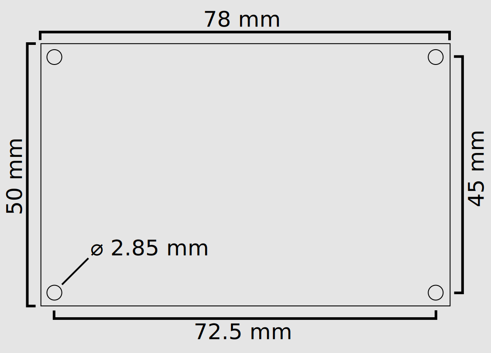
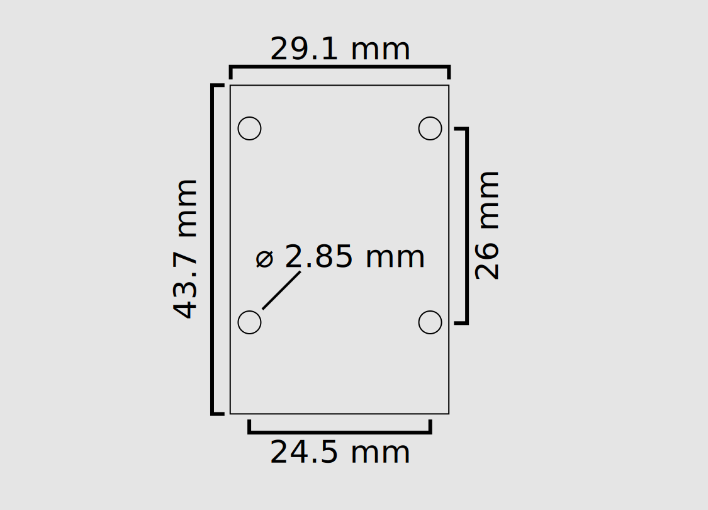

# Rocket Motor Test System
RMTS is a complete set of test stand electronics in an integrated system for amateur motor builders. It was designed to be a simple and safe way to ignite solid rocket motors and collect data from their firing. This enables hobbyists to make informed decisions as they iterate on their propellant formulas and motor designs. It is similar in complexity to a standard rocketry altimeter and doesn't require any special skills to use. It is a standalone unit, meaning you don't need to leave a computer near the motor. As it is specialized for rocketry, it displays thrust and pressure curves along with motor statistics immediately after the firing without any manual post-processing. The built-in wireless ignition channel reduces the number of devices you need to set up to one and allows you to measure the motor's start up transient as recording begins when the igniter fires.
## Components
The system consists of the main instrumentation and control board, radio board, and an application that is run on the user's computer. The main board is the larger of the two circuit boards included in the system; it has terminal blocks around the edge for connecting transducers and the igniter. The radio board is the smaller board and has two connectors: one USB port for connecting to the user's computer and an RP-SMA jack for the antenna. The software can be downloaded [here](https://github.com/reilleya/RMTS-Software/releases).
## Using RMTS
You will need to calibrate the system before using it for the first time, or if using a new transducer. This process is explained [here](https://github.com/reilleya/RMTS-Manual#calibration).
To assemble and use the system for a series of static fires, follow [this](https://github.com/reilleya/RMTS-Manual#firing-procedure) guide.
**Be sure you have read and are familiar with all parts of this guide before setting up the system**. It is a good idea to do a practice firing with a lightbulb or bare e-match connected to the pyro channel to check that the system is set up properly and that you understand it how to use it.

## Board Dimensions

## LED Explanations

The main board has four LEDs to indicate system status. The first is the `Power` indicator, which turns on as soon as the board is connected to power. Next to it is the `Status` light, which has a number of blink patterns to show which state the board is currently in. The `Continuity` LED indicates that the system has detected continuity through the igniter circuit, including both the pyro battery and the igniter itself. Finally, the `Firing` indicator shows if the igniter port has a voltage across it. Never connect the igniter while this light is on. If it is on at any time other than while you are holding the `Fire` button, your RMTS has been damaged. Next to each LED is a pair of through-holes that an external LED can be connected to.

#### Status LED Blink Patterns
| Pattern                  | Explanation                                                                                                                                 |
|--------------------------|---------------------------------------------------------------------------------------------------------------------------------------------|
| Two Fast Blinks          | System is in `setup` state. It is for a firing or calibration.                                                                              |
| Constant, Rapid Blinking | System is in `error` state. Connect to it with the radio for more details.                                                                  |
| On                       | System is in `fire` state. Stop it in the application to view results.                                                                      |
| Slow Blinking            | System is in `results` state. The results can be viewed in the application. It can be safely powered off as the results are on the SD card. |
| Off                      | There may be an issue with your power source or RMTS.                                                                                       |
## Setup
### Additional Tools
You will need these supplies beyond what is included in the RMTS kit:
* A MicroSD card, formatted FAT32
* A mini USB cable
* A 6-14 volt battery capable of firing your igniters
* A small flathead screwdriver for screw terminals
* Your motor(s), igniter(s), and test stand

### Hardware
Follow the connection diagram [here](https://github.com/reilleya/RMTS-Manual#connection-diagram). All system functions require an SD card to be installed, and the board will enter an [error state](https://github.com/reilleya/RMTS-Manual#the-system-gives-me-an-error-code-on-startup) if one isn't detected. Note that the pyro battery and transducers require a specific polarity! The system may be damaged or produce incorrect results if they are not connected properly. For this reason, and to protect the main board from damage during tests, it is recommended to mount it in a project enclosure and to attach connectors to the screw terminals so transducers can be plugged in easily. The board starts as soon as power is applied to the screw terminals labeled "main". Power only needs to be applied to the "pyro" terminals when about to fire, so these inputs should have separate switches even when using a single battery.

#### Connection Diagram

#### Transducer Connection

The transducers must be connected with this polarity because the board can only read positive signals. If a load cell with 5 wires is used, the yellow or bare wire should be connected to the same terminal as the ground wire.

The included pressure transducers have a 1/8" NPT fitting. When integrating a pressure transducer into a motor, make sure it isn't directly exposed to combustion products as this will quickly damage it. Instead, install it into a pipe attached to the forward closure and pack the pipe with grease. The grease will insulate the pressure transducer but still transmit pressure to it. 

#### Pyro Circuit Setup
The main board's built-in ignition system features a single pyro channel that requires two connections: one to a pyro battery (which can be separate from the main power source or the same) and the other to the igniter itself. The system can handle pyro batteries up to 30V, but much less is required for most igniters. The maximum current the pyro channel can continuously handle is 5A, though it might be able to handle more for brief bursts. It is **critical** to the longevity of your RMTS that you calculate the current that your battery and igniter will put through the pyro circuit and make sure that it doesn't exceed 5A for long periods of time. To do so, divide the voltage of your battery by the resistance of one of your igniters, which will give you the current that combination will pass through the system. If it is >5A, you might want to try a different battery or add a 1 ohm resistor in series with the igniter to limit current through it. 
* Polarity is important for the pyro battery connection, and that connecting a battery incorrectly can damage the main board. 
* Be sure to attach the igniter to something or have a way for it to easily disconnect from the main board, otherwise it can lead to it being knocked loose or pulled into the exhaust by the igniter as the motor comes up to pressure. I usually wrap the leads around a bolt in the test stand a couple of times to avoid this.

#### Radio Setup
The included radio modules operate in the 2.4 GHz band and can be used without any special licensing. Each radio is paired to only communicate with the other module it was shipped with, so it is safe to operate multiple units simultaneously. The included antennas can be replaced with other 2.4 GHz RP-SMA antennas if the range that the unit is being used at exceeds what the stock configuration allows. 

### Software Setup
Install the RMTS application on a computer that is convenient to bring to your test site and has at least one USB A port. The latest version can be downloaded [here](https://github.com/reilleya/RMTS-Software/releases). An installer is available for Windows and an executable for Mac OS, but Linux users will have to follow instructions in the readme for that repository. Once the application is installed, configure the desired units on the `Preferences` menu and then proceed to calibration. The Windows installer sets up the application itself as well as the driver required for the radio baord. No special driver is needed on Mac OS or Linux. I've seen strange behavior when connecting the radio board to Windows machines that don't have the driver installed, so I recommend installing it before ever plugging the radio in. 
## Calibration
RMTS is different from other rocketry electronics you may be familiar with as its sensors are external to the board and can be swapped by the user. This is beneficial as it allows you to use transducers well suited for each motor you fire and you may be able to use ones you already have. The downside is that the characteristics of sensors you choose to use cannot be built into the software and have to be determined by you. The RMTS application includes a workflow to make this process simple, and this guide explains how to use it and what is happening internally.
### What is a transducer?
A transducer is a device that converts a signal from one kind of energy (mechanical, thermal, electrical, etc) to another. The transducers that we are interested in for testing rocket motors are sensors, which convert a property of the physical world into a signal that we can read. The specific sensors that RMTS is designed to read from are [load cells](https://en.wikipedia.org/wiki/Load_cell) and [pressure transducers](https://en.wikipedia.org/wiki/Pressure_sensor), which convert force and pressure, respectively, into electrical signals. For more details on how they do this, consult the articles linked to above.
### What is transducer calibration?
The transducers that RMTS is designed to work with output a voltage that corresponds to the force or pressure that is applied to the transducer. There is no single standard that specifies what voltage a transducer should produce for a given input. Even multiple transducers of the same model have slightly different outputs for the same physical input. Fortunately, most transducers produce a simple linear response to their input, as shown in the figure. By applying a few different inputs to the transducer and measuring the outputs, we can find the relation and use it to convert any future voltage readings RMTS makes to the real quantities they correspond to.
### RMTS Calibration Workflow
The RMTS application provides a workflow that collects the data required to perform a transducer calibration. It can be accessed by pressing the `Calibrate Transducers` button on the main menu. 

On this screen, enter a name for the transducer calibration and select the type (Load Cell or Pressure Transducer). Next, connect the transducer you are looking to calibrate to your main board according to the connection diagram. Power on the main board and make sure it is nominal (SD inserted) before connecting the radio board to your computer, refreshing the list of ports, and pressing connect. If everything is set up properly, the `Data Age` field will stay close to 0 and no error will be displayed. Press the `Next` button, which will be enabled at this point.

You are now on the main calibration screen. This screen displays the last raw value read from the transducer selected on the previous screen in the top left of the window in a unitless field. Next to it is a button that allows you to "capture" the current value that the transducer is outputting and add it to the table below. You can also capture transducer values with the space bar. To calibrate the transducer, apply a series of known inputs and capture each, then enter the corresponding measurement in real units. For example, if you have a pressure transducer attached to a regulated gas supply, you could set the regulator for 200 PSI, click `Capture`, and then type `200` next to the raw value in the table. When a point has both a raw and a real value associated with it, it will be plotted in the graph. When at least three points have been entered, the software will calculate a line of best fit for them and plot it over them. It will also show the current real value obtained by converting the last transducer reading it has received through the calibration that has been made. More points make a better calibration!

Once you are satisfied with the calibration, press `Save` and the calibration will be recorded.

### Calibration Tips
* Being careful with this process is important because the data you get from the system is only as good as the calibration you perform.
* Though two points define a line and are technically all that is needed to perform a calibration, the RMTS software doesn't allow you to save a calibration that has less than three points. This is because each point has some associated measurement error, but the more points you enter, the less impact this noise has.
* It is a good idea to use inputs along a range that goes to as close to the limits of the transducer as possible. For example, a 2000 N load cell could be calibrated with points at 0, 500, 1000, 1500, and 1750 N. The goal is that the system shouldn't have to extrapolate significantly (or at all, ideally) to convert any measurement it makes during real use. Though the transducer should be linear over its range, this is only to an extent and only understanding how it responds in the 0 - 200 N range can lead to error if it is going to be used to measure 1500 N. Even if the transducer is perfectly linear, measurement error on small inputs adds up quickly when extrapolating. If that same 2000 N load cell was only calibrated to 200 N with a single measurement that was 20 N off due to a faulty reference scale or bad technique, it would result in an error of 150 N at 1500 N. If it was instead calibrated with the same error to 1000 N, it would only be 30 N off at 1500 N. More data points in that limited range can help counteract the error, but it is a good idea to use a large range as well.
* Look for sources of error in your calibration method and attempt to correct them. For example, a common procedure for calibrating load cells is to stack objects of known weight on the load cell to produce a variety of inputs. There is nothing wrong with this method in theory, but in practice it can be difficult to balance the items on the load cell, which can lead to them leaning on something other than the load cell. This means that not all of their force is transferred into the load cell, which will lead to your calibration overestimating the force applied during tests. To avoid this, use a beam-type load cell (which is easier to attach masses to), or place your load cell on the reference scale, tare it, and then apply the weights as before. Though they will likely have to lean against something for support, this no longer matters as the same force is being transmitted through the load cell and the scale so it can be measured accurately.

### Example Calibration Apparatus

#### Pressure Transducer
The easiest way I have found to calibrate pressure transducers is with a grease gun and a pre-calibrated gauge. Find a grease gun with an NPT fitting (such as [this one](https://www.mcmaster.com/1060K52/) from McMaster) and connect a 4-way junction. Attach the gauge to one of the three remaining ports on the junction, a valve to another, and the pressure transducer to the last one. Make sure to use teflon tape for all of the connections! With the valve open, pump the grease gun until air has been purged from the system. Close the valve and the system is ready to be pressurized with more pumps of the grease gun handle. Once you have captured the data required to calibrate the transducer, depressurize the system by opening the valve.

#### Load Cell
For load cells with small capacities, stacking items of known mass on the load cell is a good strategy. Be sure all of the force from the calibration apparatus is going though the load cell! For load cells with high enough capacities that this calibration technique isn't practical (thousands of newtons or above) I recommend using an arbor press and a hydraulic force gauge. I sourced a cheap press from Harbor Freight that works well for calibration purposes. Hydraulic force gauges are available as premade units or can be built easily. I followed [these instructions](https://www.skylighter.com/blogs/how-to-make-fireworks/arbor-press-force-gauge). Be sure to pick a gauge appropriate for the forces you intend to measure. Using the ram in the instructions, 900 lbf corresponds to ~400 PSI. A 600 PSI gauge will allow most users to read any force they need to more accurately than a 2000 PSI gauge as there will be more graduation marks in the range they are using.

## Firing Procedure
Once the transducers have been calibrated, the system is ready for a firing and can be integrated into the motor and test stand as shown in the connection diagram [above](https://github.com/reilleya/RMTS-Manual#connection-diagram). The transducers should be connected before the main power. Start the RMTS application on your computer and navigate to `Setup Firing`.

Once on this menu, pick the port for the radio, the transducers that are being used, and enter the motor information. Next to the transducer selectors are labels that state the maximum value that RMTS will be able to read from that transducer as calibrated. If you expect a test to reach near to this value or the transducer manufacturer's stated limit (whichever is lower), you must pick another transducer to get accurate results. The motor information requested is as follows:
| Field              | Explanation                                                                                                                                                                                                                                                                                                                                                                                                      |
|--------------------|------------------------------------------------------------------------------------------------------------------------------------------------------------------------------------------------------------------------------------------------------------------------------------------------------------------------------------------------------------------------------------------------------------------|
| Firing Orientation | `Vertical` indicates that the motor is sitting on top of the load cell and will exhaust upwards. This setting adds thrust to the readings to account for the propellant mass that is included when the system tares immediately before firing. Use `Horizontal` for any configuration where the motor is not resting on the load cell. This setting has no effect if the test is conducted without a load cell.  |
| Propellant Mass    | The mass of the propellant for the test _only_. Should not include casting tubes, liner, or other consumables. Used to calculate specific impulse and characteristic velocity.                                                                                                                                                                                                                                   |
| Throat Diameter    | The diameter of the nozzle throat, used to calculate characteristic velocity.                                                                                                                                                                                                                                                                                                                                    |
| Cutoff             | The thrust or pressure threshold used to detect the end of the firing. RMTS does not stop recording until you instruct it to, but this threshold is used to trim the data in the graph. All recorded data is preserved so you can always adjust it later.                                                                                                                                                        |
| Fire Duration      | The amount of time that voltage is applied to the igniter. E-match-based igniters take well under 250 ms to fire; other igniters might take longer.                                                                                                                                                                                                                                                               |

Make sure all of this information is entered carefully. Though it can be edited later, the system can not produce an accurate output without correct inputs like the precise propellant mass which is difficult to determine post-firing. Once the inputs are confirmed, press `Connect`. 

After a short delay, the current tared readings from the pressure transducer and load cell should be displayed. Both should stay very close to zero, and you can confirm that the load cell is connected properly by pressing on the motor and seeing that the force shows up. Once satisfied that the transducers are connected properly, connect _ONLY_ the pyro battery (not the igniter). The firing LED should stay off, which indicates that it is safe to connect the igniter. If the firing light turned on, DO NOT CONNECT THE IGNITER. This indicates that there is voltage across the igniter terminals, which means that there has been hardware failure or that something was not connected properly. As long as the light is off, it means it is safe to connect the igniter. The continuity LED should now be on and the RMTS application should show continuity. At this point the motor is ready to fire, so retreat to a safe distance.

Once far from the motor, type `ARM` into the first textbox in the `Fire` box and hold the `Control` (Windows) or `Command` (Mac OS) key. This arms the system. Once armed, it will fire the motor once `Fire` is pressed. DO NOT ARM WHEN PEOPLE ARE NEAR THE MOTOR. The firing button instructs the board to fire as long as it is held. Continue to hold it down until the igniter has fired. The application only shows data age and continuity during the firing so your focus isn't divided between the motor and the screen.
When the motor has burned out, type `STOP` into the second textbox in the `Fire` box, hold the same key you held to arm the system, and press `Stop Recording`. This button only has to be pressed once and will instruct the board to stop as soon as it is pressed. The board will continue to record for about half of a second after receiving the stop packet and then will start to send results. The `Initial Results` field in the bottom right of the window shows how many seconds of results have been received. This number should count up steadily to the length of the recording - at which point the application will move to the results screen.

The results screen displays the thrust and pressure traces along with statistics about the burn. The screen is shown as soon as a sufficient portion of the results have arrived, but more datapoints are streamed while the page is open. A progress bar in the top left of the window shows the portion of the results that have been received. Below it are graphing options and buttons to export a variety of files. It is recommended to wait until the progress bar hits 100% and then press the `Firing Data` button. 

At this point, the RMTS main board should be powered off and the process repeated. The raw data collected is also on the SD card in case the file on the computer is lost. 

## Trigger Mode

This input enables the use of an external ignition system. Set up the application as if you were going to fire using the board, but instead of connecting the igniter to the ignition port, simply connect the igniter in parallel with the trigger port on the board. The board will automatically begin recording as soon as it detects a significant voltage spike. This trigger port is opto-isolated and rectified, so there is no risk of accidental ignition and polarity isn't important. It also should not trigger from a continuity check, but it is worth testing to be sure. As soon as the motor is done firing, go through the usual procedure to end the test by activating and pressing the `Stop` button. The firing data is saved to the SD card regularly, so the system can be operated in trigger mode without a computer by simply powering off the board after the firing completes. The data will be in a sequentially numbered `.MFL` file on the SD card that can be viewed by pressing `Process Raw Data` on the main menu.
## Menu Option Explanations
| Button                  | Explanation                                                                                                |
|-------------------------|------------------------------------------------------------------------------------------------------------|
| Setup Fire              | Proceeds to the firing menu, as described [here](https://github.com/reilleya/RMTS-Manual#firing-procedure).|
| Receive Results         | Skips the firing and allows you to connect to an RMTS board that is already sending results to view them.  |
| Calibrate Transducers   | Opens the menu for transducer calibration, as described in [this section](https://github.com/reilleya/RMTS-Manual#calibration).|
| Process Raw Data        | Load raw `.MFL` files from the SD card.                                                                    |
| View Saved Data         | Load processed `.fire` files.                                                                              |
| Characterize Propellant | Coming soon. Process multiple `.fire` files to extract propellant characteristics.                         |
| Preferences             | Edit application settings like default units.                                                              |
| Edit Transducer Profile | Display and edit transducer calibrations.                                                                  |
| About                   | View application and hardware info.                                                                        |
## Troubleshooting
### The results aren't right!
Many factors can contribute to results not being what you expected. It is important to note that you can't assume that data is incorrect just because it deviates from your simulation, as the prediction itself could be wrong. For the first motor with a given propellant, or a design that pushes limits in any way (high aspect ratio or mass flux, low port/throat, or pressure outside of characterized range), do not be surprised when the data returned is not what you or your simulation predicted. If a tame motor with a well-characterized propellant formula produces results outside of the expected range, or the system reports an impossible statistic (like an ISP of 300s), then it is reasonable to suspect that it is at fault. Different categories of error and their possible explanations are given below.
#### C*
Most amateur APCP formulations will deliver a characteristic velocity between 4000 and 5000 ft/s. Though it is a property of a propellant formulation, different motors using the same formula can still deliver different C* because of varied particle residence time. All else held equal, a larger motor will tend to deliver at least the C* of a smaller motor and possibly higher because combustion products spend more time in the motor and break down further. If the value for C* significantly deviates from the 4000-5000 ft/s range mentioned above or is significantly different from the estimation from an equilibrium solver like ProPEP, there might be something wrong with the experimental value. 

The equation used to calculate it in the RMTS software takes the propellant mass, nozzle throat diameter, and pressure data into account. To validate the pressure data, check the calibration of your pressure transducer. If a recalibration produces a different conversion function, the transducer might have been damaged at some point. If the pressure data checks out, move on to the propellant mass. It can be hard to tell what the propellant mass was after the burn, so it is important to keep a detailed log. The mass entered into the RMTS software should only be the propellant mass, not including casting tube. The propellant mass also factors into the ISP calculation, so if that result looks off as well, the propellant mass might be at fault. Finally, the nozzle throat input can often be the source of errors in C*. It can have a significant impact because your measured diameter is squared to calculate C*, so small errors are magnified. Even if you do measure the throat diameter perfectly, it can change significantly during the burn due to slag buildup. Decreasing throat area leads to the pressure in the motor increasing, and because the RMTS software assumes that throat diameter is constant, this increased pressure will lead to the C* being shown higher than it actually was. If you are lucky, the slag will remain on the nozzle after the burn and you can carefully remeasure the throat diameter and average it with the original diameter to find a rough approximation of the real C*. Tests where the slag remains on the throat will be progressive up until the end of the burn, even if the propellant geometry was neutral. Unfortunately, this is often not the case as slag can be dislodged during the burn. Tests where this happens will often show a hump in the middle of the pressure trace as the throat diameter decreased due to slag buildup and then increased again when the slag was dislodged. There isn't anything that can be done to recover the C* for a test like this, and it is best to try again in a larger motor that will give more complete combustion and deposit less slag.
#### ISP
The calculation for ISP takes the thrust data and propellant mass into account, so it is sensitive to load cell calibration or improper propellant mass measurements. As mentioned in the previous section, an incorrect propellant mass will impact both ISP and C* so it is important to check if it is only one that seems off or both when determining if ISP error is due to transducer calibration or propellant mass. It can be tricky to calibrate a load cell accurately over the range required for large amateur motors, so the [calibration tips](https://github.com/reilleya/RMTS-Manual#calibration-tips) section includes some guidelines for doing it properly.

### The system gives an error code when powered on
The error codes are explained in the application, but these explanations are copied here for convenience.
| Error | Meaning               | Resolution                                                                                                                                        |
|-------|-----------------------|---------------------------------------------------------------------------------------------------------------------------------------------------|
| 0.1   | No SD card detected   | Install an SD card or remove and replace the currently installed one. If it still doesn't work, try a different card.                             |
| 0.2   | SD card not writable    | The SD card cannot be written to. It might be formatted incorrectly, as the system can only work with FAT32-formatted cards. Try reformatting it. |
| 0.3   | Too many logs         | The SD card contains more than 256 log files. Remove them from the SD card to continue.                                                           |
| 1.1   | ADC self check failed | The onboard analog-to-digital converter needed to read from transducers has failed. This will likely require a repair.                            |

### I had a motor misbehave and it shut the system off before I could press stop. Is my data gone?
There is probably a way to get it back. Data is written to the SD card approximately every 400 ms (0.4 s) so as long as the test lasted longer than that before the system lost power, there should be a data file on the SD card that the software can process. Even if the test ended in less time than that or really catastrophically and destroyed the SD card, the main board continuously sends out some of the data it gathers during the firing, which is picked up by the application and logged into a special file. A log of all firings is available at `C:\Users\{USERNAME}\AppData\Local\RMTS\RMTS\firings.bak` on Windows, `/Users/{USERNAME}/Library/Application Support/RMTS/firings.bak` on Mac OS, and `/home/{USERNAME}/.local/share/RMTS/firings.bak` on a typical Linux installation. This data will probably not include all 150 samples per second that would be in the data log on the SD card, as the number of datapoints in the backup file is dependent on the strength of the radio link during the firing. Still, it is a good last resort to have and can be very informative in diagnosing failures when paired with the partial data from the SD card if it is available. Don't hesitate to reach out if you need help processing backup data.

### The radio link is too weak
First, make sure that the radio module is fully seated onto the main board and that the antennas are screwed tightly onto both the radio board and the main board. If everything is set up properly, you can improve the range by making sure both antennas are far off of the ground. The ground and other objects on it can absorb the signals that the radios emit, so try putting the main board on a stand if you need more range. The radio board can be held up to improve reception. Though this should always be the case when firing a motor, make sure there is good line of sight between the two radios. If all else fails, you can try a different 2.4 GHz antenna with better gain.   

## Glossary
* Transducer: A device that converts some value from the physical world into a signal. In this context, it usually refers to load cells and pressure sensors.
* ADC: Analog to digital converter. The component on the board that reads the signal from the transducers and outputs a corresponding number.
* Raw Value: A value directly output by the ADC. Corresponds to a voltage read from a transducer.
* Converted Value: A value in real-world units obtained by passing a raw value through a calibration function. 
* Radio Board: The smaller device that connects to a user's computer.
* Main board: The larger device that the igniter and transducers are connected to.
* Data Age: Time since the last packet was received from the board. It will hover near zero when the radio connection is strong. If it consistently reaches multiple seconds, many packets are being dropped and the connection is weak. 

## Disclaimer
Though this system was designed with safety in mind and proven with thorough testing, its output should be verified before each use to ensure it was configured correctly and that it hasn't been damaged. By using the device, you affirm that you understand the proper operation of the system and accept responsibility for any loss of property, injury, or death that may occur as a result of using RMTS. The creators of the device shall not be held liable for any damage it may cause due to the inherent risks associated with the operation of solid rocket motors.
